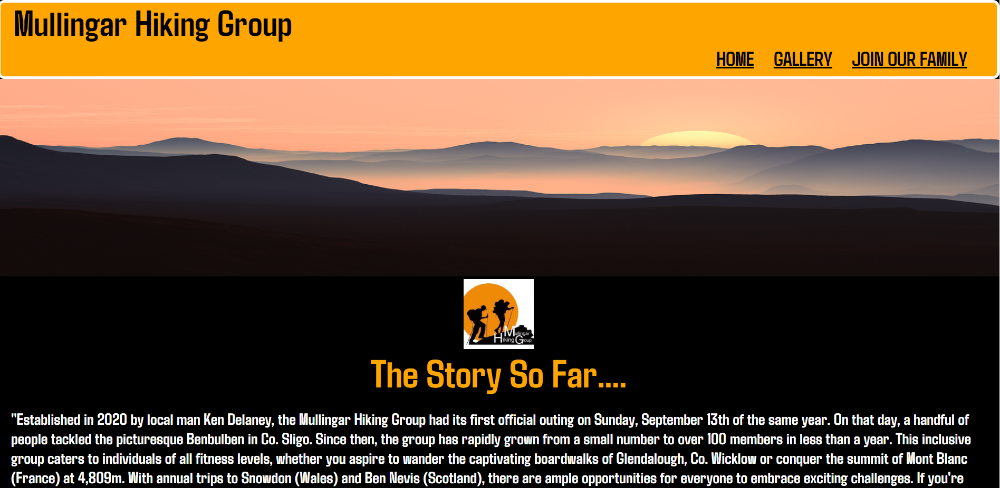
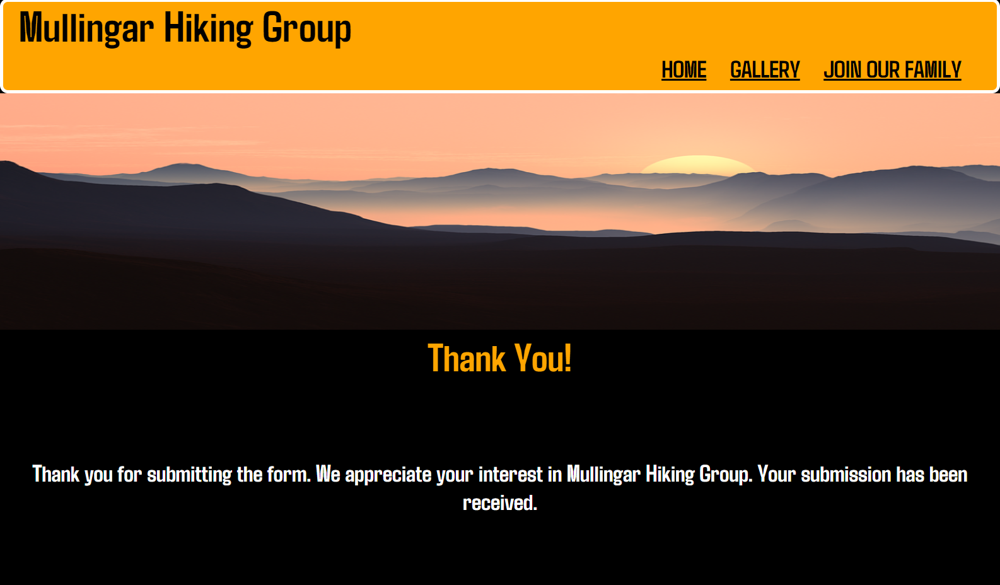
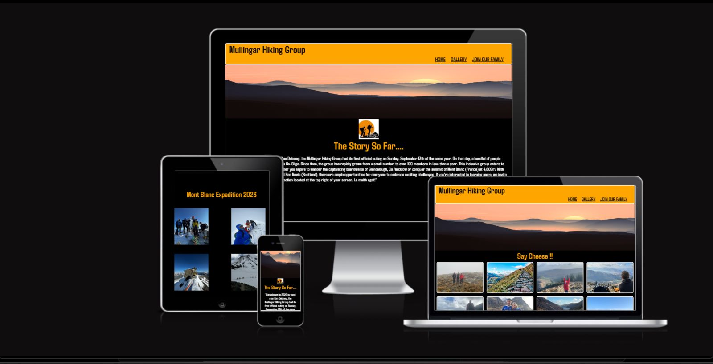

# Mullingar Hiking Group Website

## This website is to encourage people to get up, get active, view our pictures and join our group

## Table of Contents

- [Description](#description)
- [Technologies Used](#technologies-used)
- [Features](#features)
- [Bugs](#bugs)
- [Code](#Code)
- [Deployed](#Deployed)
- [Testing](#Testing)
- [Contact](#contact)

## Description

"This website aims to enhance the brand of Mullingar Hiking, which has experienced significant growth in its membership over the past few years. The breathtaking pictures captured during these hikes are truly exceptional. To showcase these remarkable experiences, I have created a gallery page where people can also share their own hiking adventures through the website."

## Technologies Used

In this project, I utilized HTML and CSS. Throughout the process, I sought guidance and inspiration from various outlets. One of my go-to resources was the One Month Podcast and my Coding for Dummies book, which provided invaluable tips and tricks for mastering these languages. To enhance my understanding of flexbox, I extensively explored W3Schools, experimenting with code and gaining hands-on experience. Additionally, I found great value in watching YouTube videos from channels such as Kevin Powell, LinkedIn Learning, and Dee Mc. For text fonts, I leveraged Google Fonts, while Unsplash served as a reliable source for captivating background and gallery images, sourced specifically from the Mullingar Hiking Group. To help with my grammar and spelling, I used ChatGPT. Lastly, I incorporated Font Awesome for social media icons.

"My idea was a simple one: to build a three-page portfolio-style website. However, instead of it being for an individual, this portfolio would be for our hiking group. I will continue to add to it as I learn more about Javascript and PHP in the coming months. Eventually, I plan to put it live on the web."

The most difficult part of this project was making the site responsive to smaller screen sizes. I used a few different outlets for ideas, and then I utilized dev tools with the information I had to tweak my project.

Here are some links to videos that helped me with my Home Page.

Kevin Powell : 5 simple tips to making responsive layouts the easy way
https://www.youtube.com/watch?v=VQraviuwbzU&t=365s

Dee Mc : Quick Guide to CSS Flexbox
https://www.youtube.com/watch?v=2uvyx4YK_rQ&list=PLXuTq6OsqZjYGLkK4d0RExJ98-m-IOIc2&index=3

Making my "Peaks by Province" table section was a challenge. I used a few different outlets to achieve it, including:

CSS Tricks : https://css-tricks.com/under-engineered-responsive-tables/

Chat GPT : https://chat.openai.com/

Ravi Web : How To Create Responsive Table In HTML & CSS || How To Make Responsive Table Using HTML & CSS
https://www.youtube.com/watch?v=HKWtJPumb7g&t=321s

W3 Schools : https://www.w3schools.com/css/css_table.asp

After exploring these options and using W3Schools, I would rewrite the code multiple times and see what worked best.

After watching Dee Mc's video on Flexbox, I realized what a powerful tool it is. I then created a container for the first time at the bottom of my home page, containing images from the Mullingar Hiking Group's trip to Mont Blanc in France. I also used a container on my form.html page. To practice different scenarios, I utilized W3Schools and dev tools.

Coding for Dummies: Book 3, Chapter 5, 'Responsive Flexbox,' was also a massive help. This book has been a valuable tool, and I intend to continue using it in the future.

Adding my Favicon I used https://favicon.io/favicon-converter/

I followed the stpes from Dee Mc in her Youtube Video
https://www.youtube.com/watch?v=W809I-d9xTg&t=2s

Gallery page :

My gallery page was a lot more straightforward. I used the same navigation and footer as my home page to maintain consistency in the UX design flow of the website. For the layout, I employed a simple HTML structure and styled the page using flex, as mentioned in the home page section. The images used on my gallery page were either mine or were sent to me by members of the hiking group. I wanted to keep the website as authentic as possible.

Form page (Join our family):

For my form page I watched : 24: Forms In HTML and CSS | How To Create A Form | Learn HTML and CSS | HTML Tutorial | CSS Tutorial by Danni Krossing
https://www.youtube.com/watch?v=E5MEzC0prd4

This video gave me multiple ideas to work with, and I experimented with various types of forms and flex directions. I found it difficult to maintain form consistency on smaller screens, but by using dev tools and trying hundreds of different variations, I eventually achieved satisfaction with the final product. Once again, I utilized the same navigation and footer as the previous pages to maintain consistency in the flow of the website.

Thank you page :

With no PHP database to store my form entries, my mentor suggested creating a thank you page. I designed a simple HTML page, once again utilizing the same navigation and footer as the previous pages to maintain consistency in the flow of the website. On this page, I included a straightforward H1 'Thank you' heading with a brief message. Additionally, I implemented a Meta Refresh and linked it to my index.html page, so after 10 seconds, the user would be redirected back to the homepage of my site.

My website should no errors or contrast errors when I ran it thorugh WAVE (web accessibility evaluation tool)

## Features

Home Page: 

About Me Section: Provides information about the Mullingar Hiking Group and its background.
Our Mission Section: Describes the group's mission, goals, and values.
Pictures from the 2023 Mont Blanc Expedition: Displays images showcasing the group's recent adventure.
Gallery Page:

Gallery (Member Pictures): 

Displays a collection of photos contributed by the group's members. This allows members to share their hiking experiences visually.
Join Our Family Form Page:

Join our famly (Form Submission): 

Offers a form for users interested in joining the Mullingar Hiking Group. Users can provide their information and submit the form.

Thank You Page: 

Confirmation Message: Displays a thank you message to users who have successfully submitted the join form.

Auto-Redirect: Automatically redirects the user to the home page after 10 seconds, providing a seamless user experience.

These features provide essential components for the Mullingar Hiking Group's website, allowing visitors to learn about the group, explore photos from past expeditions, and express their interest in joining. The automatic redirection from the thank you page to the home page ensures a smooth flow for users after submitting the form.

404 page: 

The 404 page is an essential component of our website's user experience. When a user tries to access a page that doesn't exist or encounters an error, our 404 page is displayed to guide them. This page is designed to provide a user-friendly and informative experience, helping visitors navigate back to our website's main content. It includes a clear message indicating that the requested page couldn't be found and offers a prominent link back to the home page, ensuring users can easily return to familiar territory. We have also carefully designed the 404 page to maintain the overall look and feel of our website, providing a cohesive and branded experience even in error situations.

## Bugs

I encountered a peculiar issue with my homepage not rendering correctly on mobile screens. It would only occupy half of the phone's width. To investigate and troubleshoot the problem, I utilized dev tools and accessed my GitHub pages on my mobile phone. I have attached screenshots to provide a clearer understanding of the issue.

Strangely, this issue occurred sporadically. However, I discovered that if I navigated to my gallery or form page and then returned to the home page, the problem would be resolved, and the homepage would display perfectly. I sought assistance from Code Institute's tutor support, who reported that the page loaded fine on their end without any apparent issues. Additionally, I posted a question on Stack Overflow and discord, where my code was reviewed, but no issues were identified. To eliminate any caching-related concerns, I made sure to clear my cache after every page reload. Despite these efforts, the issue persisted, occurring approximately 50% of the time for me.

Please refer to the attached screenshots for a visual representation of the problem.

I spent the whole day on Slack and Stack Overflow looking for a fix for this bug. I posted my project for review in the peer-review section of Slack. A few kind people responded with different suggestions, but none of them worked. Eventually, I received more tutoring support from Code Institute, and Sean suggested that I might be using too much padding on the homepage elements for smaller screen sizes. I went through my CSS and noticed that I had a lot of padding on my 'about-us' and 'our mission' sections. I removed the padding and added a margin of 20px. Finally, my project started rendering correctly. I have attached a screenshot of the padding I removed from a previous Git commit.

[Image not rendered correctly](assets/images/bugfix.png)

## Code

I made sure to validate all my HTML pages, including the index, form, gallery, thank you, and 404 pages, using the W3C Validator. This tool thoroughly examined my code and ensured its compliance with HTML standards. I'm pleased to report that all my HTML code passed the validation process without any errors. Similarly, I also ran my CSS code through the validator, and it successfully cleared the validation with no issues. Taking these steps to validate both my HTML and CSS code gives me confidence that my website meets the industry standards and follows best practices, resulting in a well-structured and error-free codebase.

## Deployed

I have developed a project using HTML and CSS, and it is currently hosted on GitHub Pages. To create the project, I utilized Code Anywhere as my code editor. If you wish to explore the project, you can visit the deployed link at:

https://danij1990.github.io/mullingar-hiking/index.html.

## Testing

# Responsiveness

To ensure optimal responsiveness for my website, I undertook a rigorous testing process across various breakpoints, namely 1010px, 780px, and 450px media queries. With the primary objective of delivering a flawless user experience, I meticulously assessed every aspect of the website's design and functionality at each breakpoint.

Starting with the 1010px breakpoint, I focused on the transition from desktop to tablet view. I evaluated the layout, font sizes, and image scaling to guarantee a seamless visual transition without sacrificing content integrity. The navigation was thoroughly scrutinized to ensure easy access to all sections, while maintaining an uncluttered and intuitive feel.

Moving on to the 780px breakpoint, my attention shifted to optimizing the website for tablet and larger phone screens. I fine-tuned the spacing, margins, and padding to create a balanced and aesthetically pleasing layout. Buttons and interactive elements were adjusted to be touch-friendly, enhancing user engagement and interaction.

Finally, I tested the website at the 450px media query, where the focus was on ensuring the site's adaptability to smaller phone screens. This demanded careful consideration of font sizes, images, and the reorganization of content to fit within the limited space without compromising readability or usability.

Throughout the testing process, I meticulously reviewed the site's behavior and appearance at each breakpoint, and the results were highly gratifying. The website demonstrated remarkable responsiveness, flawlessly adjusting its layout and design according to the screen size. Each breakpoint offered a seamless user experience, and the content remained easily accessible and legible across all devices.

In conclusion, the meticulous testing of my website at breakpoints of 1010px, 780px, and 450px media queries yielded the desired outcome. The site displayed exceptional responsiveness, effortlessly adapting to various screen sizes while retaining its functionality and aesthetics. Users could navigate the website effortlessly, regardless of the device they were using, culminating in a successful implementation of the correct actions required for a seamless and user-friendly experience.

## Contact

Daniel Hughes, Mullingar Co Westmeath, Ireland.

Phone : +353 852570069

Email : danijhughes@gmail.com

Git Hub : danij1990

Linkedin: https://www.linkedin.com/in/daniel-hughes-36a948258/
